<div align="center">

# ANTIGRAVITY · NOMA

**Un vendedor con IA en el WhatsApp de tu negocio.**
Plataforma SaaS multi-tenant que conecta el WhatsApp de un negocio a un bot con Gemini que atiende clientes, toma pedidos, cobra y despacha domicilios, todo administrado desde un panel web.


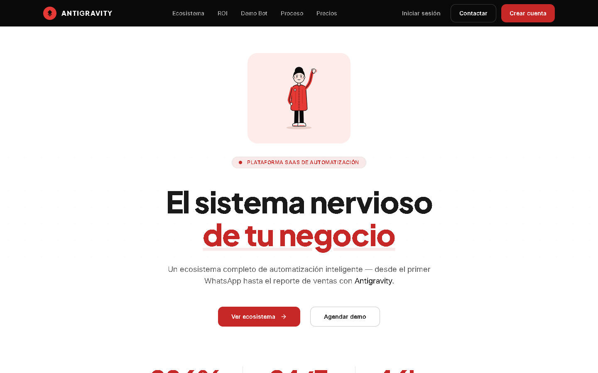

</div>

---

## Contenido

- [Qué hace](#qué-hace)
- [Capturas](#capturas)
- [El equipo NOMA](#el-equipo-noma)
- [Arquitectura](#arquitectura)
- [Estructura del repositorio](#estructura-del-repositorio)
- [Puesta en marcha](#puesta-en-marcha)
- [Variables de entorno](#variables-de-entorno)
- [Planes](#planes)
- [API](#api)
- [Seguridad](#seguridad)
- [Estado del proyecto](#estado-del-proyecto)
- [Solución de problemas](#solución-de-problemas)

---

## Qué hace

| | |
|---|---|
| **Bot de ventas por WhatsApp** | Un `BotInstance` (Baileys) por negocio. El bot usa el catálogo, los medios de pago y las políticas que el dueño carga en el panel; si no hay catálogo, no inventa uno. |
| **Pedidos y pagos** | Crea pedidos desde la conversación, recibe el comprobante de pago y lo deja en `pago_enviado` para que el dueño lo confirme. |
| **Domicilios con mapa** | El bot **confirma la dirección con el cliente** antes de crear el pedido, la geocodifica, calcula la ruta por calles y la tarifa por kilómetro, y dibuja la ruta en el mapa. Incluye portal del domiciliario y tracking público para el cliente. |
| **Onboarding guiado** | Cuenta mínima + checklist de activación (catálogo → cómo cobras → conectar WhatsApp). La prueba gratis de **7 días** empieza en la primera conexión de WhatsApp. |
| **Panel del negocio** | Dashboard, pedidos, productos, clientes, conversaciones, analytics, automatizaciones, domicilios, suscripción y ajustes. |
| **Automatizaciones** | Re-engagement, reseñas, reporte semanal, recordatorios y campañas masivas (cola Bull + Redis). |
| **Bot de llamadas** | Voz con Twilio + [Clonar-voz](Clonar-voz/README.md), mismo cerebro que WhatsApp, solo plan Enterprise. |
| **Panel de administración** | Gestión de negocios, WhatsApps, suscripciones y logs para el superadmin. |

---

## Capturas

### Landing y acceso

<table>
  <tr>
    <td width="50%">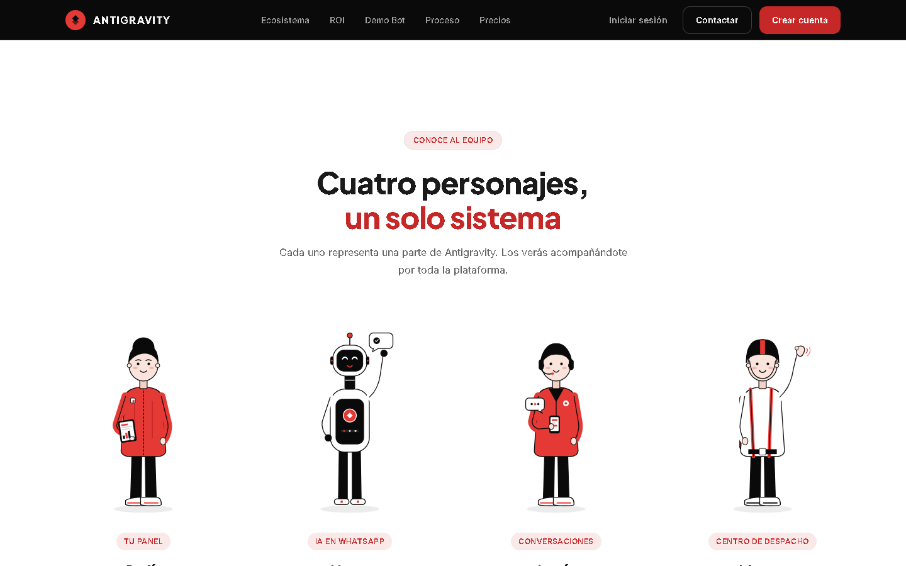<br><sub><b>Landing</b> · «Conoce al equipo»</sub></td>
    <td width="50%">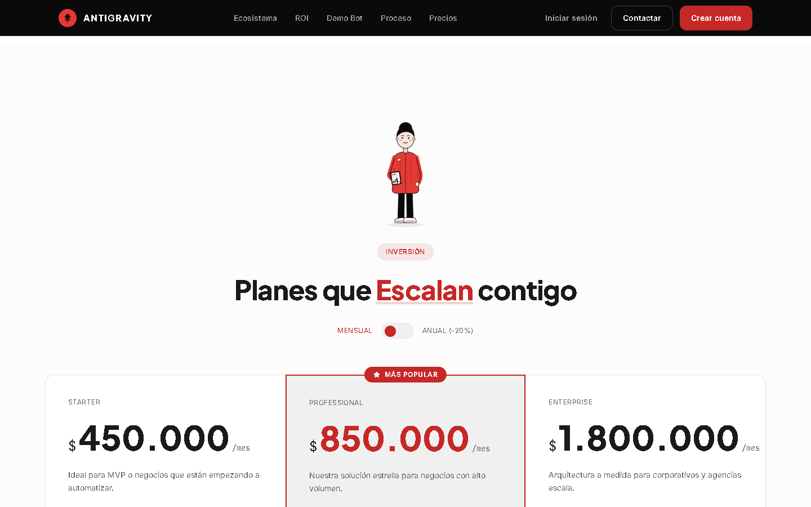<br><sub><b>Landing</b> · planes y precios</sub></td>
  </tr>
  <tr>
    <td width="50%">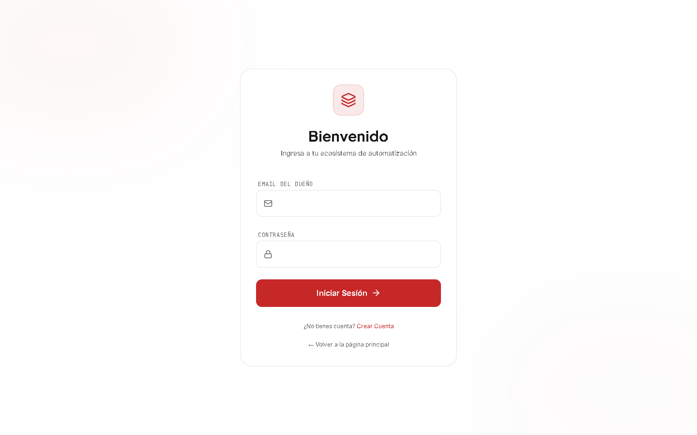<br><sub><b>Inicio de sesión</b></sub></td>
    <td width="50%">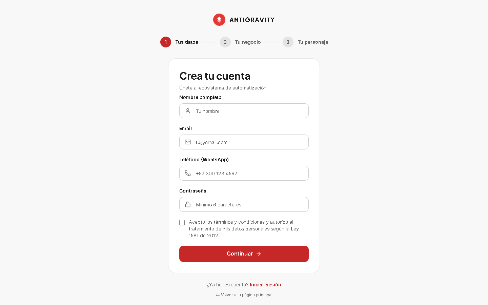<br><sub><b>Registro</b> · 3 pasos, con creación del personaje del dueño</sub></td>
  </tr>
</table>

### Panel del negocio

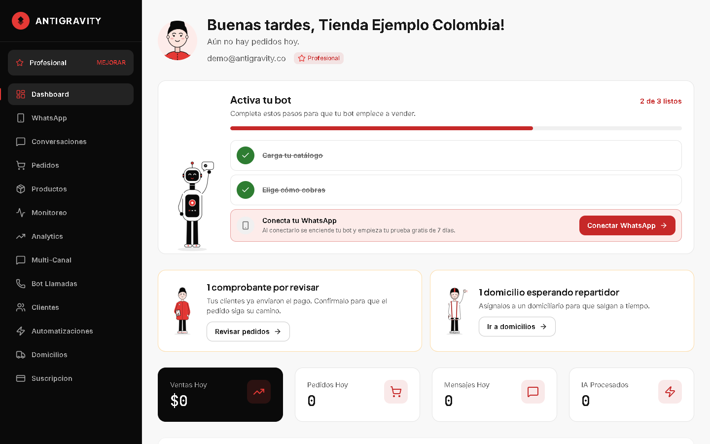

<sub><b>Dashboard</b> · saludo con el avatar del dueño, checklist de activación guiado por Nova, aviso de comprobantes por revisar y métricas del día.</sub>

<table>
  <tr>
    <td width="50%">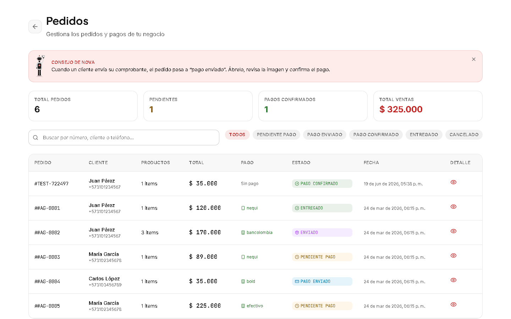<br><sub><b>Pedidos</b> · estados de pago, filtros y totales</sub></td>
    <td width="50%">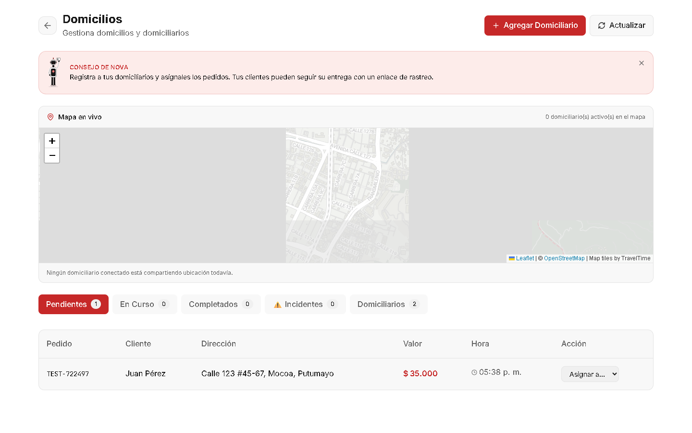<br><sub><b>Domicilios</b> · mapa en vivo y centro de despacho</sub></td>
  </tr>
  <tr>
    <td width="50%">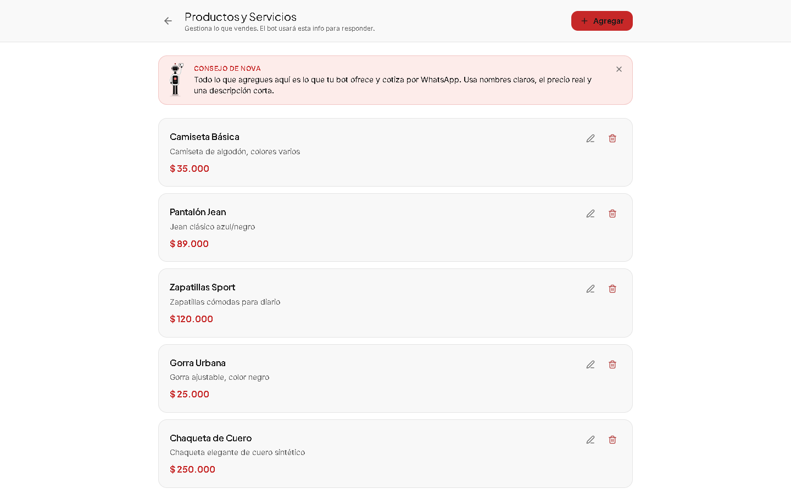<br><sub><b>Productos</b> · el catálogo que el bot usa para cotizar</sub></td>
    <td width="50%">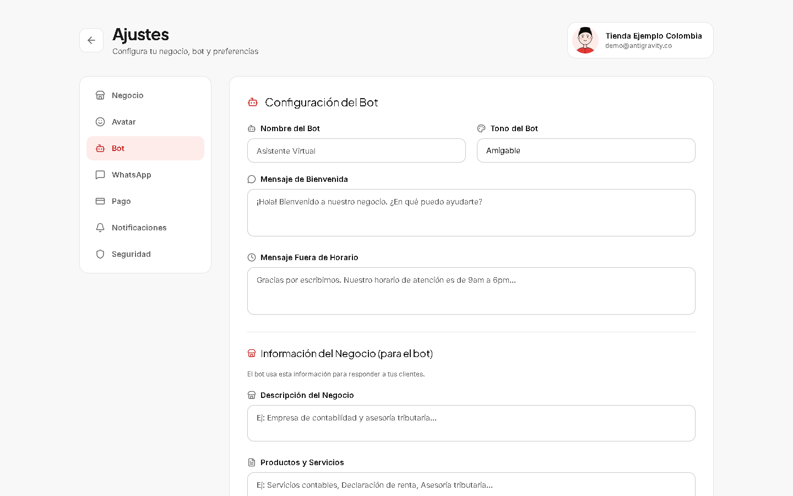<br><sub><b>Ajustes → Bot</b> · nombre, tono y mensajes del bot</sub></td>
  </tr>
</table>

> Las capturas usan la cuenta demo del `seed.sql` (datos ficticios). Se generan con Chrome headless contra el entorno local.

---

## El equipo NOMA

La interfaz tiene personajes ilustrados con un rol fijo: son la voz visual de la marca (definida en [`design.md`](design.md)).

<table>
  <tr>
    <td align="center" width="25%"><br><b>Sofía</b><br><sub>Ventas y logros</sub></td>
    <td align="center" width="25%"><br><b>Nova</b><br><sub>IA en WhatsApp · guía</sub></td>
    <td align="center" width="25%"><br><b>Lucía</b><br><sub>Atención y conversaciones</sub></td>
    <td align="center" width="25%"><br><b>Mateo</b><br><sub>Domicilios y despacho</sub></td>
  </tr>
</table>

Además, cada dueño crea **su propio avatar** (cuerpo, piel, peinado, barba, gafas, tatuajes y ropa) al registrarse; aparece en el saludo del dashboard, en los avisos de éxito y en Ajustes.

**Sistema de diseño:** tema claro por defecto, base neutra en negro/gris/blanco y rojo `#E53935` como único color de acción (tokens en `agency-platform-react/src/index.css`).

---

## Arquitectura

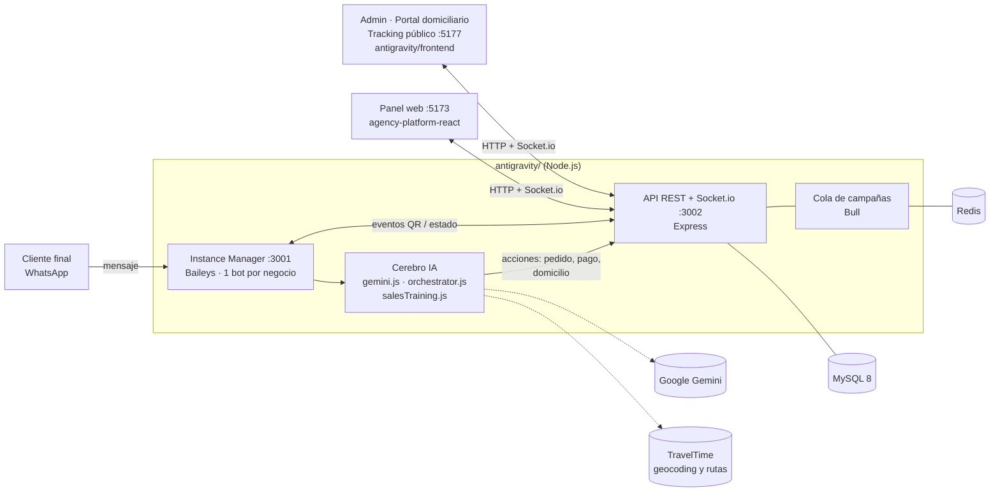

**Cómo fluye un pedido:** el cliente escribe → el Instance Manager entrega el mensaje al cerebro (Gemini) con el prompt armado desde el catálogo del negocio → el bot detecta la compra, confirma la dirección con el cliente y ejecuta la acción (crear pedido y domicilio) → la API guarda, geocodifica, calcula ruta y tarifa, y emite el evento por Socket.io → el dashboard lo muestra en tiempo real.

> El antiguo `brain/` en Python (FastAPI + OpenAI) **fue retirado**: hoy hay un solo cerebro, en Node, dentro de `instance-manager/`.

### Dos frontends, dos propósitos

| Carpeta | Puerto | Para qué sirve |
|---|---|---|
| `agency-platform-react/` | **5173** | **Landing pública + dashboard del negocio** (el que se usa en el día a día). |
| `antigravity/frontend/` | **5177** | **Panel admin** (`/admin/*`), **portal del domiciliario** (`/delivery/*`) y **tracking público** (`/delivery/track/:token`). Sus rutas `/dashboard/*` son heredadas y las reemplazó `agency-platform-react`. |

---

## Estructura del repositorio

```
Bot NOMA/
├── agency-platform-react/        # Landing + dashboard del negocio (React 19 + Vite + Tailwind 4)
│   └── src/
│       ├── pages/                # Dashboard, Pedidos, Productos, Domicilios, Ajustes, Suscripción…
│       ├── components/           # Landing, Toast, EmptyState, ActivationChecklist, EstadoNegocio, TipNova…
│       │   └── avatar/           # Editor y renderer por capas del avatar del dueño
│       ├── context/              # AuthContext, BrandingContext, HitosContext (logros)
│       ├── assets/illustrations/ # Personajes y escenas en SVG
│       └── services/             # api.js, socket.js
│
├── antigravity/                  # Backend + frontend admin/domicilios
│   ├── api/                      # API REST (Express :3002) + Socket.io
│   │   ├── middleware/           # auth, tenant, seguridad, rate limit
│   │   ├── routes/               # auth, business, whatsapp, bot-config, pedidos, productos,
│   │   │                         # domicilios, campañas, suscripción, stripe, voice, admin…
│   │   └── services/             # avatar, etc.
│   ├── instance-manager/         # Bots de WhatsApp (Baileys :3001)
│   │   ├── InstanceManager.js    # Crea y supervisa una instancia por negocio
│   │   ├── BotInstance.js        # Conexión Baileys de un negocio
│   │   ├── agents/               # gemini.js · orchestrator.js · salesTraining.js
│   │   └── services/             # geocoding.js · routing.js · domicilioTarifa.js
│   ├── queue/                    # Workers Bull (campañas masivas, requiere Redis)
│   ├── db/                       # schema.sql, seed.sql y migraciones (migrate_*.js)
│   ├── config/planConfig.js      # Fuente única de verdad de planes, precios y features
│   ├── frontend/                 # Admin + portal domiciliario + tracking (React + Vite)
│   ├── infra/                    # docker-compose, PM2, nginx
│   └── start.bat                 # Arranque de todos los servicios en Windows
│
├── Clonar-voz/                   # Clonación de voz local usada por el bot de llamadas
├── docs/screenshots/             # Capturas que usa este README
├── design.md                     # Sistema de diseño NOMA (tokens, tipografía, personajes)
└── README.md
```

---

## Puesta en marcha

### Requisitos

| Herramienta | Versión | Notas |
|---|---|---|
| Node.js | 20+ | Backend y frontends |
| MySQL | 8.0+ | Base de datos multi-tenant |
| Redis | 7+ | **Opcional**: solo para campañas masivas |
| Cuenta de Google AI | — | `GEMINI_API_KEY` para el cerebro del bot |

### 1. Instalar dependencias

```bash
git clone https://github.com/Estebandev-ved/SAAS-Mocoa-medellin.git
cd "Bot NOMA"

npm install --prefix antigravity
npm install --prefix agency-platform-react
npm install --prefix antigravity/frontend      # solo si vas a usar admin / portal domiciliario
```

### 2. Configurar el entorno

```bash
cd antigravity
cp .env.example .env        # en Windows: copy .env.example .env
```

Completa `.env` (ver [Variables de entorno](#variables-de-entorno)). Para el dashboard crea `agency-platform-react/.env.local`:

```env
VITE_API_URL=http://localhost:3002
VITE_SOCKET_URL=http://localhost:3002
VITE_ANTIGRAVITY_URL=http://localhost:5177
VITE_TRAVELTIME_APP_ID=tu_app_id      # tiles del mapa de domicilios
```

### 3. Crear la base de datos

```bash
mysql -u root -p -e "CREATE DATABASE antigravity CHARACTER SET utf8mb4;"
mysql -u root -p antigravity < antigravity/db/schema.sql
mysql -u root -p antigravity < antigravity/db/seed.sql     # opcional: datos demo

cd antigravity
node run-migrations.js                                      # migraciones incrementales
```

### 4. Arrancar

**Windows (todo en uno):**

```bash
cd antigravity
.\start.bat
```

**Manual / desarrollo** (con recarga automática vía nodemon):

```bash
cd antigravity
npm run dev:api        # API en :3002
npm run dev:bot        # Instance Manager en :3001
# o ambos:  npm run dev:all

cd ../agency-platform-react
npm run dev            # Landing + dashboard en :5173
```

> La API y el Instance Manager **no recargan solos** si los lanzas con `npm start` / `node`. Usa los scripts `dev:*` o reinícialos tras cambiar código en `api/` o `instance-manager/`.

### URLs

| Servicio | URL |
|---|---|
| Landing + dashboard | http://localhost:5173 |
| Admin / portal domiciliario / tracking | http://localhost:5177 |
| API REST | http://localhost:3002 |
| Health check | http://localhost:3002/health |
| Instance Manager | http://localhost:3001 |

**Cuenta demo** (solo local, creada por `seed.sql`): `demo@antigravity.co` / `Demo2024#`. Cámbiala antes de cualquier despliegue.

### Conectar tu WhatsApp

1. Inicia sesión en el dashboard → **WhatsApp** → **Conectar**.
2. Escanea el QR con el teléfono (WhatsApp → Dispositivos vinculados).
3. Listo: el bot responde y arranca tu prueba gratis de 7 días.

---

## Variables de entorno

Plantilla completa en [`antigravity/.env.example`](antigravity/.env.example). Nunca subas `.env` al repositorio.

| Grupo | Variables |
|---|---|
| **IA** | `GEMINI_API_KEY` |
| **MySQL** | `MYSQL_HOST`, `MYSQL_USER`, `MYSQL_PASSWORD`, `MYSQL_DATABASE` |
| **Redis** (opcional) | `REDIS_HOST`, `REDIS_PORT` |
| **Seguridad** | `JWT_SECRET`, `SOCKET_SECRET` — sin valor por defecto, defínelos siempre |
| **Correo** | `SMTP_HOST`, `SMTP_PORT`, `SMTP_USER`, `SMTP_PASS`, `OWNER_EMAIL` |
| **Puertos / URLs** | `PORT_API` (3002), `PORT_INSTANCE_MANAGER` / `PORT_BOT` (3001), `FRONTEND_URL`, `FRONTEND_API_URL`, `FRONTEND_SOCKET_URL`, `NODE_ENV` |
| **Mapas** | `TRAVELTIME_APP_ID`, `TRAVELTIME_API_KEY` (geocoding y rutas; la key nunca va al frontend) |
| **Bot de llamadas** | `CLONAR_VOZ_URL`, `STT_PROVIDER`, `DEEPGRAM_API_KEY` / `WHISPER_API_KEY`, `TWILIO_ACCOUNT_SID`, `TWILIO_AUTH_TOKEN`, `TWILIO_PHONE_NUMBER`, `VOICE_PUBLIC_URL`, `TWILIO_VALIDATE_SIGNATURE` |

---

## Planes

Definidos en un solo lugar: [`antigravity/config/planConfig.js`](antigravity/config/planConfig.js). Precios en COP por mes.

| | **Starter** | **Professional** | **Enterprise** |
|---|---|---|---|
| Precio | $450.000 | $850.000 | $1.800.000 |
| Números de WhatsApp | 1 | 3 | Ilimitados |
| Clientes | 100 | 500 | Ilimitados |
| Productos | 20 | Ilimitados | Ilimitados |
| Mensajes / mes | 1.000 | 5.000 | Ilimitados |
| Analytics avanzado y automatizaciones | — | ✅ | ✅ |
| Domicilios | — | ✅ | ✅ |
| Multi-sede, integraciones, OCR de pagos | — | — | ✅ |
| Bot de llamadas | — | — | ✅ |

---

## API

Todas las rutas cuelgan de `/api` y, salvo `auth` y el tracking público, requieren JWT. Cada consulta se filtra por `negocio_id` (multi-tenant).

| Prefijo | Qué maneja |
|---|---|
| `/api/auth` | Registro (con avatar y términos), login, verificación, recuperación de contraseña |
| `/api/business` | Perfil, plan y uso, onboarding, plantillas por tipo de negocio, `GET/PUT /avatar` |
| `/api/whatsapp` | Estado, conexión con QR y desconexión del bot |
| `/api/bot` | Configuración del bot (nombre, tono, mensajes, info de negocio, pagos, políticas) y prueba sin WhatsApp |
| `/api/conversaciones`, `/api/chat` | Historial y envío manual de mensajes |
| `/api/pedidos`, `/api/productos`, `/api/clientes` | Pedidos y estados de pago, catálogo, clientes |
| `/api/domicilios` | Despacho, domiciliarios, tarifas (`PUT /modulos/config`), portal del repartidor y tracking público (`/public/track/:token`) |
| `/api/automations`, `/api/campanas`, `/api/horarios` | Automatizaciones, campañas masivas y horarios |
| `/api/analytics`, `/api/agentes` | Métricas y uso del cerebro IA |
| `/api/suscripcion`, `/api/stripe` | Suscripción, upgrade/downgrade, facturas y pagos |
| `/api/voice`, `/api/telegram`, `/api/instagram` | Bot de llamadas y canales adicionales |
| `/api/admin`, `/api/usuarios`, `/api/backup` | Superadmin, usuarios del negocio y respaldos |

Ejemplo:

```bash
curl -X POST http://localhost:3002/api/auth/login \
  -H "Content-Type: application/json" \
  -d '{"email":"demo@antigravity.co","password":"Demo2024#"}'
```

---

## Seguridad

- JWT en usuarios y Socket.io; `JWT_SECRET` y `SOCKET_SECRET` sin valor por defecto.
- Aislamiento por negocio en cada query y en cada sala de socket (corregido el IDOR detectado en la auditoría; ver [`antigravity/SECURITY_AUDIT.md`](antigravity/SECURITY_AUDIT.md)).
- Helmet, CORS con lista de orígenes, rate limiting global y por plan, sanitización XSS y `express-validator`.
- Contraseñas con bcrypt, bloqueo por intentos fallidos y consentimiento de datos (Ley 1581).
- Avatar validado con lista blanca en el servidor.
- Firma de webhook de Twilio verificada en el bot de llamadas.
- Sesiones de WhatsApp (`auth_info/`) y `.env` fuera del repositorio.

---

## Estado del proyecto

Rama de trabajo actual: **`redisenio-noma`** (rediseño visual completo con el sistema NOMA).

**Hecho**
- Cerebro único con Gemini dentro del Instance Manager; auditoría de seguridad multi-tenant.
- Flujo de domicilios completo: dirección confirmada, geocoding, ruta por calles, tarifa por km, portal del domiciliario y tracking.
- Onboarding progresivo con checklist y prueba de 7 días desde la primera conexión.
- Rediseño NOMA: tokens, personajes, avatar del dueño, hitos, estados vacíos y avisos de éxito/error.
- Bot de llamadas con Twilio + Clonar-voz.

**Pendiente**
- Pantalla en el dashboard para configurar la **tarifa por km** (el backend ya existe).
- Catálogo por categorías y fotos para restaurantes.
- UI de cancelar/downgrade/facturas en Suscripción (el backend ya existe).
- Persistir hitos y consejos de Nova en backend (hoy en `localStorage`).
- Probar el bot de llamadas con una llamada real (ngrok + webhook de Twilio).
- Tests automatizados y `docker-compose` de producción completo.

El detalle día a día está en [`.claude/DAILY_LOG.md`](.claude/DAILY_LOG.md).

---

## Solución de problemas

<details>
<summary><b>No conecta a MySQL</b></summary>

Verifica las credenciales de `.env` y que el servicio esté activo (`net start mysql` en Windows). Comprueba con `mysql -u root -p -e "SHOW DATABASES;"`.
</details>

<details>
<summary><b>Cambié código del backend y sigo viendo el comportamiento viejo</b></summary>

`node api/index.js` no recarga en caliente. Reinicia el proceso o usa `npm run dev:api` / `npm run dev:bot`.
</details>

<details>
<summary><b>Error de CORS en el navegador</b></summary>

El origen del frontend debe estar permitido (`isAllowedOrigin()` en `api/middleware/security.js`) y `NODE_ENV=development` en local.
</details>

<details>
<summary><b>El bot de WhatsApp no conecta</b></summary>

Confirma que la API **y** el Instance Manager están corriendo. Si el QR queda en bucle, borra `antigravity/auth_info/auth_info_<negocioId>/` y vuelve a conectar desde el dashboard.
</details>

<details>
<summary><b>Las campañas masivas no se envían</b></summary>

Requieren Redis y el worker de `queue/`. `start.bat` avisa si Redis no responde en `localhost:6379`.
</details>

<details>
<summary><b>«Demasiadas peticiones» al iniciar sesión</b></summary>

El rate limit de autenticación se libera solo tras un minuto.
</details>

<details>
<summary><b>El mapa de domicilios sale sin calles</b></summary>

Falta `VITE_TRAVELTIME_APP_ID` en `agency-platform-react/.env.local`. Los tiles públicos de OpenStreetMap y Carto ya no sirven sin credenciales, por eso se usa TravelTime.
</details>

---

<div align="center">

**MIT** · Hecho en Colombia 🇨🇴

</div>
